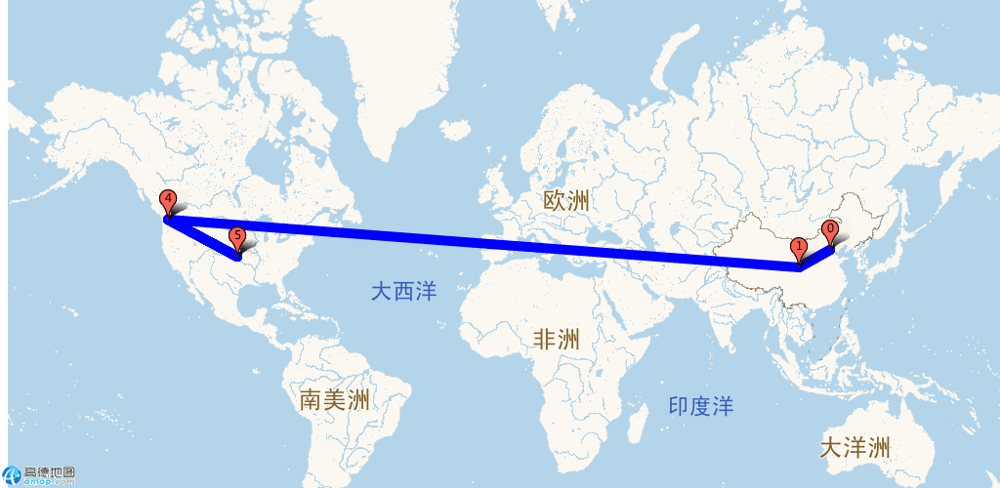

# iproute

A traceroute like tool with IP location data(from [GeoLite2IP](http://dev.maxmind.com/zh-hans/geoip/geoip2/geolite2-%E5%BC%80%E6%BA%90%E6%95%B0%E6%8D%AE%E5%BA%93/)) and visualization(from [Gaode Map](http://lbs.amap.com/api/static-map-api/guide-2/)).

# Install

    go get github.com/oschwald/geoip2-golang
    // download yourself version of GeoLite2 database
    go get github.com/aeden/traceroute
    go run src/iproute/cmd/iproute.go DOMAIN

# Example

```bash
$ sudo -E go run src/iproute/cmd/iproute.go bing.com
traceroute to bing.com (204.79.197.200), 65 hops max, 52 byte packets
1   pandorabox_2077.lan. (192.168.1.1)  1.060203ms
2   114.252.96.1 (114.252.96.1) 中国北京 5.348994ms
3   61.148.185.69 (61.148.185.69) 中国北京 5.736864ms
4   124.65.61.133 (124.65.61.133) 中国北京 7.589925ms
5   124.65.194.89 (124.65.194.89) 中国北京 7.585424ms
6   219.158.14.190 (219.158.14.190) 中国 39.953344ms
7   219.158.11.2 (219.158.11.2) 中国 55.692004ms
8   219.158.97.26 (219.158.97.26) 中国 43.479576ms
9   219.158.101.166 (219.158.101.166) 中国 44.82868ms
10  219.158.39.170 (219.158.39.170) 中国 65.228965ms
11  ae3-0.hkb-96cbe-1b.ntwk.msn.net. (191.234.84.248) 美国 50.22985ms
12  tor1.hkb.msedge.net. (131.253.5.135) 美国 53.988716ms
13  tor2.hk2.msedge.net. (131.253.5.215) 美国 51.512017ms
14  *
15  *
16  *
17  *
18  *
19  *
20  *
21  pandorabox_2077.lan. (192.168.1.1)  85.035908ms
22  *
23  pandorabox_2077.lan. (192.168.1.1)  446.773458ms
24  pandorabox_2077.lan. (192.168.1.1)  1.025469ms
25  pandorabox_2077.lan. (192.168.1.1)  897.787µs
26  114.252.96.1 (114.252.96.1) 中国北京 10.600771ms
27  114.252.96.1 (114.252.96.1) 中国北京 5.452876ms
28  114.252.96.1 (114.252.96.1) 中国北京 3.552917ms
29  61.148.185.69 (61.148.185.69) 中国北京 5.600726ms
30  61.148.185.69 (61.148.185.69) 中国北京 7.763549ms
31  61.148.185.69 (61.148.185.69) 中国北京 7.878667ms
32  124.65.61.133 (124.65.61.133) 中国北京 5.722551ms
33  124.65.61.133 (124.65.61.133) 中国北京 7.394798ms
34  124.65.61.133 (124.65.61.133) 中国北京 8.070106ms
35  124.65.194.89 (124.65.194.89) 中国北京 4.0813ms
36  124.65.194.89 (124.65.194.89) 中国北京 7.759828ms
37  124.65.194.89 (124.65.194.89) 中国北京 7.96742ms
38  219.158.14.190 (219.158.14.190) 中国 38.680327ms
39  219.158.14.190 (219.158.14.190) 中国 40.054525ms
40  219.158.14.190 (219.158.14.190) 中国 39.840022ms
41  219.158.11.14 (219.158.11.14) 中国 43.743329ms
42  219.158.11.10 (219.158.11.10) 中国 56.944486ms
43  219.158.96.226 (219.158.96.226) 中国 44.829592ms
44  219.158.96.246 (219.158.96.246) 中国 46.168254ms
45  219.158.19.89 (219.158.19.89) 中国 42.63811ms
46  219.158.96.246 (219.158.96.246) 中国 55.531853ms
47  *
48  *
49  219.158.101.166 (219.158.101.166) 中国 46.89507ms
50  219.158.101.178 (219.158.101.178) 中国 51.52412ms
51  219.158.39.170 (219.158.39.170) 中国 54.29724ms
52  219.158.39.170 (219.158.39.170) 中国 48.488625ms
53  219.158.39.170 (219.158.39.170) 中国 51.10568ms
54  ae27-0.hk2-96cbe-1b.ntwk.msn.net. (104.44.224.0) 美国雷德蒙德 47.009276ms
55  ae3-0.hkb-96cbe-1b.ntwk.msn.net. (191.234.84.248) 美国 60.14481ms
56  ae3-0.hkb-96cbe-1b.ntwk.msn.net. (191.234.84.248) 美国 49.907844ms
57  ae0-0.hk2-96cbe-1a.ntwk.msn.net. (207.46.42.64) 美国雷德蒙德 47.079828ms
58  tor5.hk2.msedge.net. (131.253.5.223) 美国 46.651123ms
59  ae0-0.hk2-96cbe-1a.ntwk.msn.net. (207.46.42.64) 美国雷德蒙德 53.496697ms
60  *
61  *
62  *
63  *
64  *
65  tor1.hkb.msedge.net. (131.253.5.135) 美国 39.135116ms

Visualize URL: http://restapi.amap.com/v3/staticmap?zoom=1&size=1024*500&markers=mid,,0:116.3883,39.9289|mid,,1:105.0000,35.0000|mid,,2:116.3883,39.9289|mid,,3:105.0000,35.0000|mid,,4:-122.1215,47.6740|mid,,5:-97.0000,38.0000|mid,,6:-122.1215,47.6740|mid,,7:-97.0000,38.0000|mid,,8:-122.1215,47.6740|mid,,9:-97.0000,38.0000&paths=10,,,,:116.3883,39.9289;105.0000,35.0000;116.3883,39.9289;105.0000,35.0000;-122.1215,47.6740;-97.0000,38.0000;-122.1215,47.6740;-97.0000,38.0000;-122.1215,47.6740;-97.0000,38.0000&key=ee95e52bf08006f63fd29bcfbcf21df0
```



```bash
$ sudo -E go run src/iproute/cmd/iproute.go twitter.com
traceroute to twitter.com (104.244.42.1), 65 hops max, 52 byte packets
1   pandorabox_2077.lan. (192.168.1.1)  1.088333ms
2   114.252.96.1 (114.252.96.1) 中国北京 11.82457ms
3   61.51.246.25 (61.51.246.25) 中国北京 6.569078ms
4   61.148.156.153 (61.148.156.153) 中国北京 7.450696ms
5   124.65.194.41 (124.65.194.41) 中国北京 9.269297ms
6   219.158.101.42 (219.158.101.42) 中国 8.647356ms
7   219.158.97.222 (219.158.97.222) 中国 8.326865ms
8   219.158.34.154 (219.158.34.154) 中国 75.658143ms
9   ae-5.r22.osakjp02.jp.bb.gin.ntt.net. (129.250.6.192) 美国恩格尔伍德 78.275398ms
10  ae-5.r31.tokyjp05.jp.bb.gin.ntt.net. (129.250.7.80) 美国恩格尔伍德 61.386059ms
11  ae-18.r00.tokyjp03.jp.bb.gin.ntt.net. (129.250.4.249) 美国恩格尔伍德 60.44681ms
12  ae-1.twitter.tokyjp03.jp.bb.gin.ntt.net. (203.105.72.74) 日本东京 199.343872ms
13  ae62.sin1-cr2.twttr.com. (199.16.158.248) 美国旧金山 242.090298ms
Visualize URL: http://restapi.amap.com/v3/staticmap?zoom=1&size=1024*500&markers=mid,,0:116.3883,39.9289|mid,,1:105.0000,35.0000|mid,,2:-104.8738,39.6237|mid,,3:139.7514,35.6850|mid,,4:-122.3933,37.7697&paths=10,,,,:116.3883,39.9289;105.0000,35.0000;-104.8738,39.6237;139.7514,35.6850;-122.3933,37.7697&key=ee95e52bf08006f63fd29bcfbcf21df0
```


# Lincense

Most code are come from [aeden/traceroute](https://github.com/aeden/traceroute)&[oschwald/geoip2-golang](https://github.com/oschwald/geoip2-golang), please follow these two libraries lincenses.
